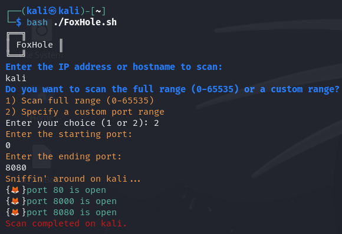
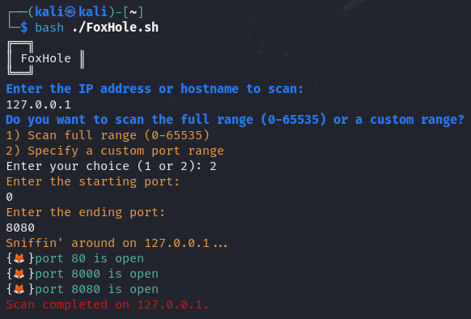

## Step 1: 
Gain a foothold on the target IP.

## Step 2:
Transfer script & execute:

```
bash ./FoxHole.sh
```



## Alternatively
You can execute a one-liner where you change the TARGET IP & PORT RANGE to scan.

```
for PORT in {0..1000}; do timeout 1 bash -c "</dev/tcp/TARGET IP/$PORT &>/dev/null" 2>/dev/null && echo "port $PORT is open"; done
```
